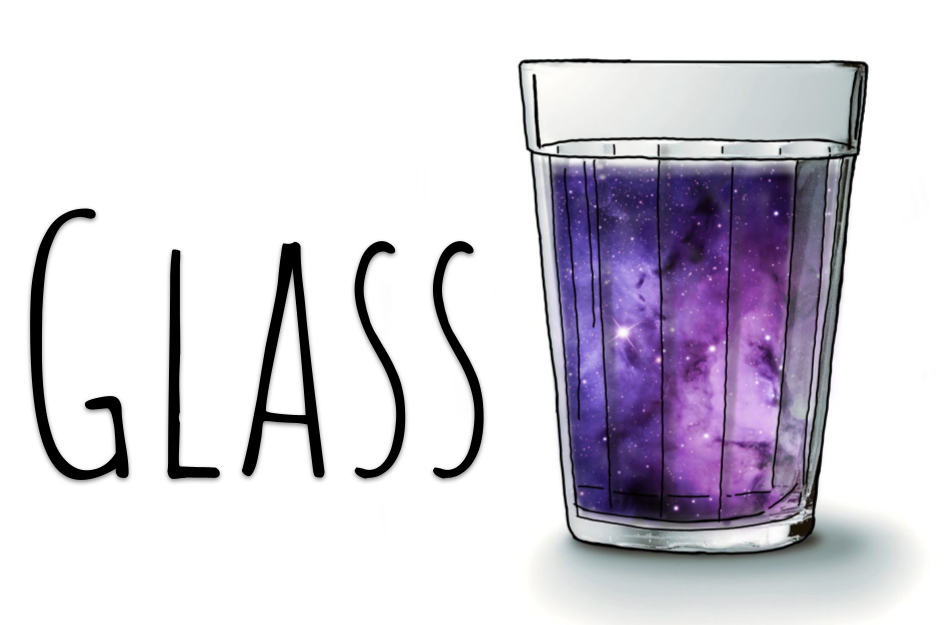

##########################################
GLASS: Generator for Large Scale Structure
##########################################

GLASS is a package for forward modelling the large scale structure of the
universe, by simulating a past lightcone over the full sky in individual
redshift slices.  GLASS is flexible and extensible, and can account for any
number and combination of probes and catalogues.

*****************
Library interface
*****************

.. toctree::
   :maxdepth: 1

******************
Indices and tables
******************

* :ref:`genindex`
* :ref:`modindex`
* :ref:`search`
