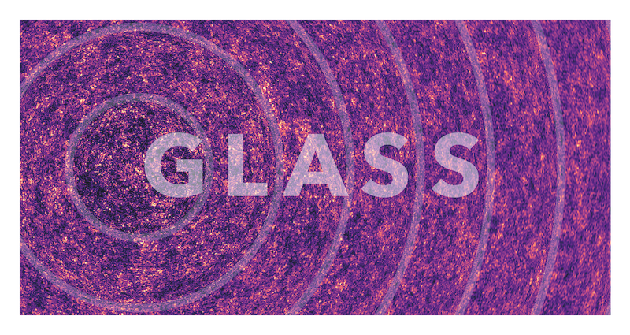

|

**********************************************
**GLASS**: Generator for Large Scale Structure
**********************************************

GLASS, the generator for large scale structure, is a library for performing the
kind of simulation that is useful in the field of cosmology.  As the name
suggests, the code was originally designed to simulate cosmic matter, weak
gravitational lensing, and galaxy positions.  But GLASS is really platform for a
wide range of cosmological and astrophysical simulations on the sphere, thanks
to its ultra-flexible design and open architecture.

=============
Documentation
=============

.. toctree::
   :maxdepth: 2

   user/index
   reference/index

==================
Indices and tables
==================

* :ref:`genindex`
* :ref:`modindex`
* :ref:`search`
